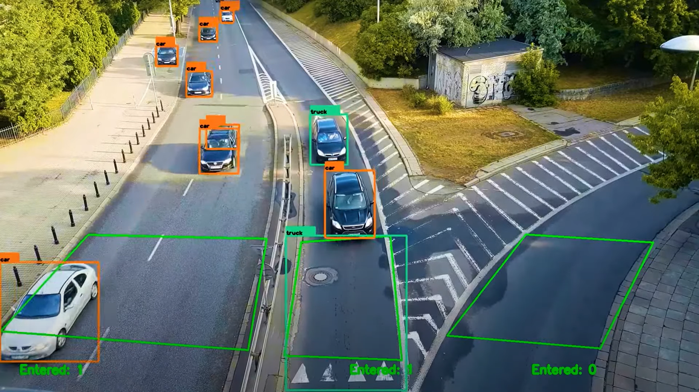
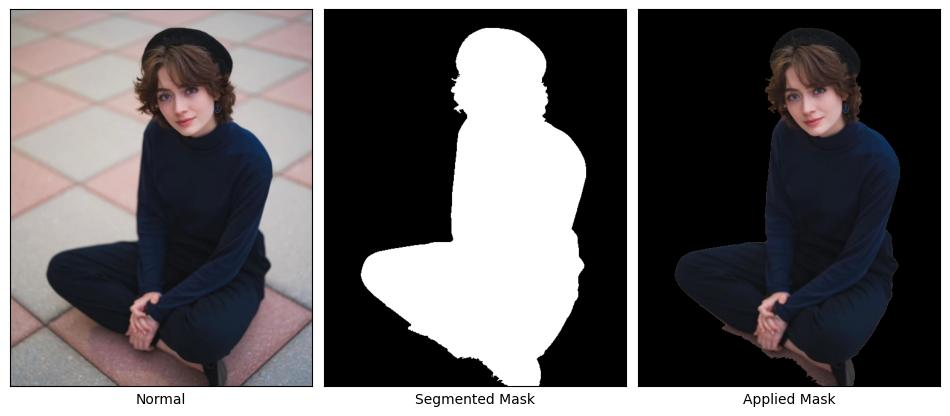
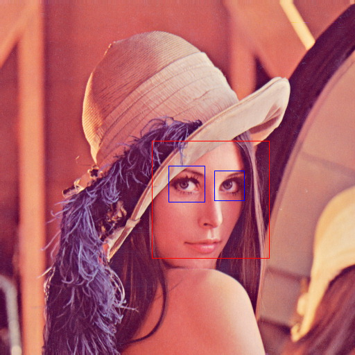

# **Pendahuluan 📘**

 

## **🤔 Apa Itu Image Processing?**

Secara umum, `image processing` adalah seni dan teknik mengolah gambar agar menjadi lebih berguna dan bermanfaat. Dengan memanipulasi gambar, kita dapat mengungkap detail tersembunyi, menyempurnakan fitur tertentu, atau mengekstrak data penting dari gambar. `Image processing` memandang gambar sebagai sinyal dua dimensi, yang memungkinkan kita menerapkan berbagai teknik pemrosesan sinyal untuk membuat gambar lebih bermakna dan lebih mudah diadaptasi dalam berbagai aplikasi. Berikut beberapa teknik utama dalam image processing:

1. **_Visualization_** 🌐 - Mengungkap objek atau detail dalam gambar yang tidak langsung terlihat.
2. **_Recognition_** 🔍 - Mengidentifikasi dan membedakan objek dalam sebuah gambar.
3. **_Sharpening and Restoration_** ✨ - Memperbagus atau memperbaiki gambar, meningkatkan kualitas dan kejernihan.
4. **_Pattern Recognition_** 📊 - Mengidentifikasi pola berulang dan mengukur berbagai elemen di sekitar objek dalam gambar.
5. **_Retrieval_** 🔄 - Mencari dan mengambil gambar serupa dari database yang besar.

 

## **🌐 Aplikasi Image Processing**

- **Traffic Sensing and Monitoring** 🚗

  

- **Image Segmentation** 🖼️

  

- **Face Detection** 😎

  

 

  <a href="../README.md" style="
    display: inline-block;
    background-color: #e3383a;
    color: #fff;
    padding: 12px 24px;
    font-size: 16px;
    font-weight: bold;
    text-decoration: none;
    border-radius: 8px;
    transition: background-color 0.15s;
  " onmouseover="this.style.backgroundColor='#4caf50';" onmouseout="this.style.backgroundColor='#e3383a';">
    Kembali
  </a>

