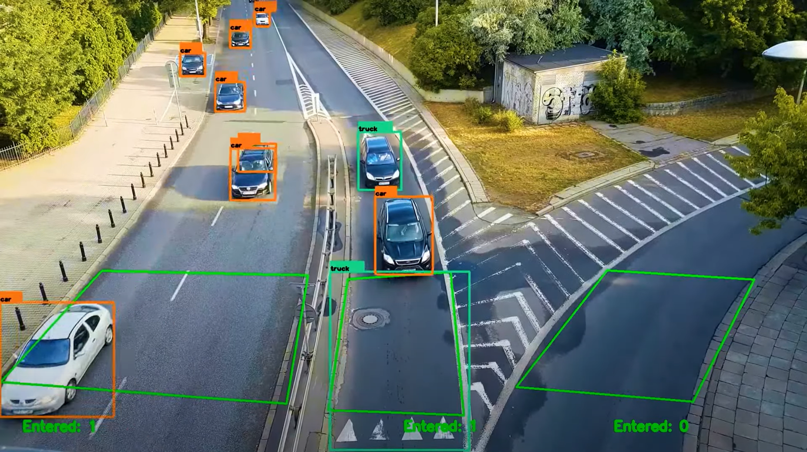
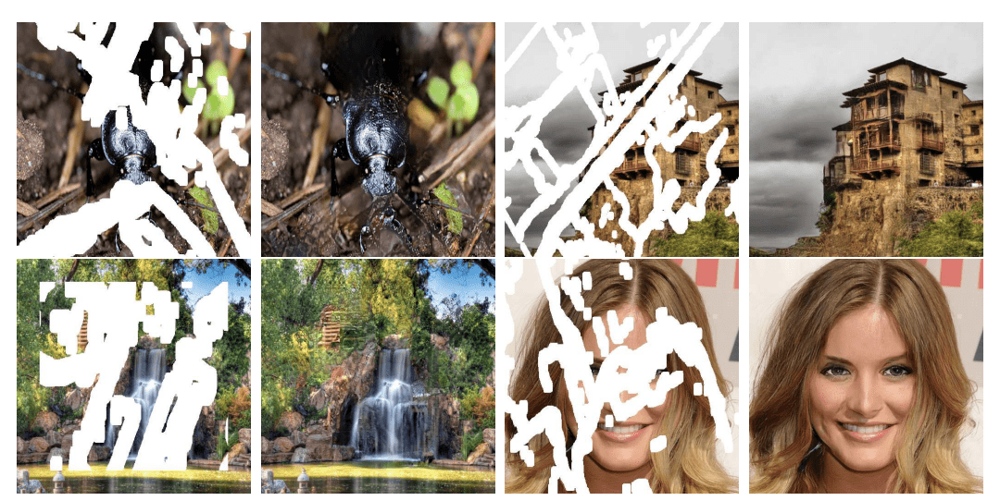

# **Pendahuluan 📘**

 

## **🤔 Apa itu Image Processing?**

Pada dasarnya, **Image Processing** adalah seni dan ilmu mengubah gambar agar lebih berguna dan bermanfaat. Dengan memanipulasi gambar, kita dapat mengetahui detail tersembunyi, menyempurnakan fitur tertentu, atau mengekstrak data penting dari gambar. Image processing menganggap gambar sebagai sinyal 2D, yang memungkinkan kita menerapkan berbagai teknik pemrosesan sinyal pada gambar tersebut, menjadikan gambar lebih bermakna tetapi juga lebih mudah diadaptasi untuk berbagai aplikasi.

Key Types of Image Processing:

1. **Visualization** 🌐 - Uncover objects or details in images that aren't immediately visible.
2. **Recognition** 🔍 - Identify and distinguish objects within an image.
3. **Sharpening and Restoration** ✨ - Enhance or repair an image, improving quality and clarity.
4. **Pattern Recognition** 📊 - Identify recurring patterns and measure various elements around objects in the image.
5. **Retrieval** 🔄 - Search and retrieve similar images from extensive digital databases.

 

## **🌐 Aplikasi dari Image Processing?**

### 1. **Traffic Sensing and Monitoring** 🚗

### 2. **Image Reconstruction** 🖼️

### 3. **Face Detection** 😎

 

### **Source:**

[1] [Image Processing Overview](https://www.simplilearn.com/image-processing-article#types_of_image_processing)
