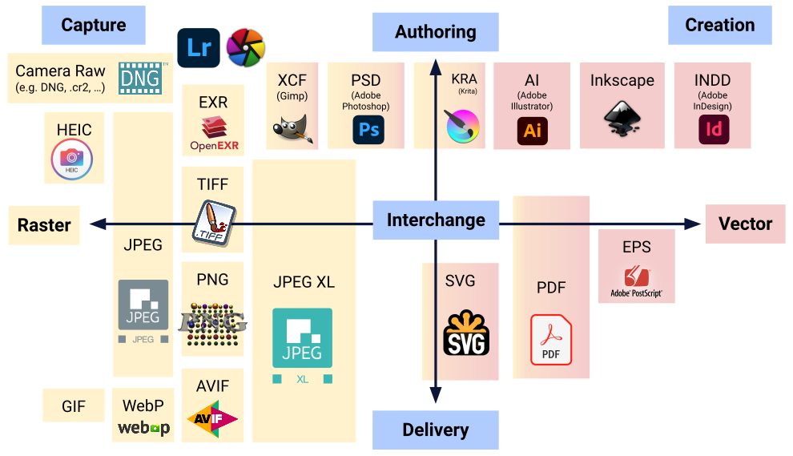
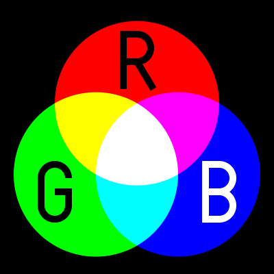
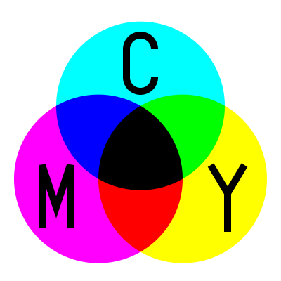
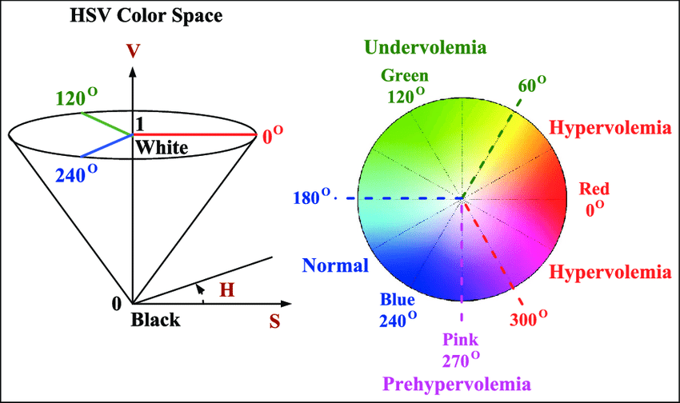

# **Working with Images 🖼️**

</br>

## **📸 Apa Itu Gambar?**

**`Gambar`** adalah representasi visual berupa _array_ dua dimensi yang terdiri dari titik-titik kecil yang disebut `piksel`, di mana setiap piksel menyimpan informasi `warna dan kecerahan`. Ukuran gambar, seperti 1920 x 1080 (lebar x tinggi), mengacu pada jumlah total piksel. Misalnya, gambar berukuran **2,073,600 piksel** atau **2 megapiksel**. Setiap piksel menyerupai ubin kecil yang jika disusun bersama membentuk gambar utuh.

Berikut adalah cara piksel merepresentasikan warna:

- **Grayscale** 🖤 - setiap piksel memiliki nilai antara 0 (**Hitam**) hingga 255\* (**Putih**).
- **RGB** 🌈 - setiap piksel memiliki tiga nilai untuk masing-masing _channel_ **Merah** (Red), **Hijau** (Green), dan **Biru** (Blue), dengan nilai antara 0 hingga 255\*.
- **RGBA** 🌫️ - merupakan RGB dengan tambahan satu _channel_ **Alpha** untuk menyimpan nilai transparansi.

\*untuk gambar 8-bit.

</br>

## **📂 Apa Saja Format Gambar yang Umum?**

Format gambar yang sering digunakan meliputi:



**Sumber:** [Image file format - Wikipedia](https://en.wikipedia.org/wiki/Image_file_format)

</br>

## **🌈 Color Space pada Gambar**

_Color space_ atau ruang warna adalah cara untuk merepresentasikan warna dalam gambar. Berikut beberapa ruang warna yang umum digunakan:

- **RGB (Red, Green, Blue)** - Ruang warna untuk layar, bersifat _additive_.

  

- **CMYK (Cyan, Magenta, Yellow, Black)** - Ruang warna untuk percetakan, bersifat _subtractive_.

  

- **HSV (Hue, Saturation, Value)** - Ideal untuk mengatur intensitas warna dan kecerahan secara terpisah.

  

</br>

## **📥 Membaca, Menampilkan, dan Menyimpan Gambar**

- Membaca gambar:

  ```python
  cv2.imread("path_to_image")
  ```

- Menampilkan gambar:

  ```python
  cv2.imshow("window_name", image)
  ```

- Menyimpan gambar:

  ```python
  cv2.imwrite("name.format", image)
  ```

- Mendapatkan informasi pada gambar:

  ```python
  # Informasi ukuran gambar
  print(img.shape)

  # Informasi pixel
  print(img[200,200]) # informasi pada piksel di baris 200, kolom 200
  ```

- Membaca dan menampilkan beberapa gambar secara bersamaan:

  ```python
  import glob

  path = glob.glob("../assets/*.jpeg")

  for index, file in enumerate(path):
      img = cv2.imread(file)
      cv2.imshow(f'Image {index + 1}', img)
  ```

</br>

## **➕ Operasi Aritmatika Sederhana pada Gambar**

```python
# Menambahkan dua gambar
cv2.add(img1, img2)

# Mengurangi satu gambar dari gambar lainnya
cv2.subtract(img1, img2)

# Menambahkan dua gambar dengan bobot tertentu
cv2.addWeighted(img1, img1_weight, img2, img2_weight, gamma_value)
```

</br>

<div style="text-align: center; margin: 24px;">
  <a href="../README.md" style="
    display: inline-block;
    background-color: #e3383a;
    color: #fff;
    padding: 12px 24px;
    font-size: 16px;
    font-weight: bold;
    text-decoration: none;
    border-radius: 8px;
    transition: background-color 0.15s;
  " onmouseover="this.style.backgroundColor='#4caf50';" onmouseout="this.style.backgroundColor='#e3383a';">
    Kembali
  </a>
</div>
