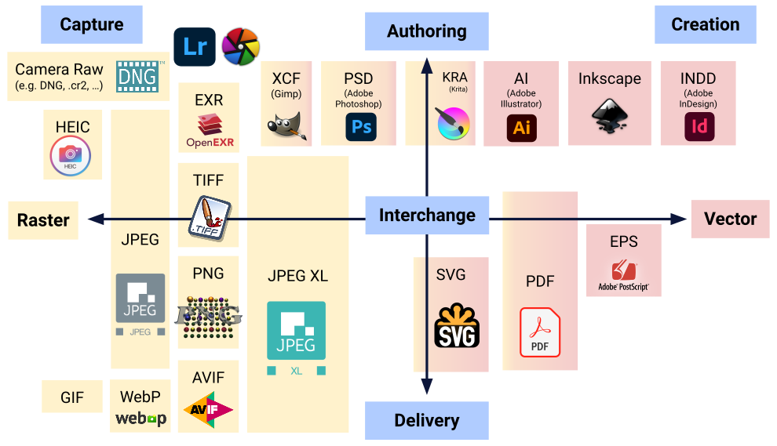
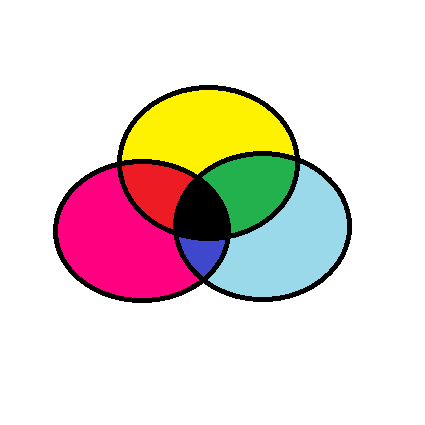

# Working With Images ✨

</br>

## **What Is an Image?** 🤔

An image is represented by its dimensions (height and width) based on the number of pixels. For example, if the dimensions of an image are 500 x 400 (width x height), the total number of pixels in the image is 200000.

This pixel is a point on the image that takes on a specific shade, opacity or color. It is usually represented in one of the following:

- **Grayscale** - A pixel is an integer with a value between 0 to 255 (0 is completely black and 255 is completely white).

- **RGB** - A pixel is made up of 3 integers between 0 to 255 (the integers represent the intensity of red, green, and blue).

- **RGBA** - It is an extension of RGB with an added alpha field, which represents the opacity of the image.

Image processing requires fixed sequences of operations that are performed at each pixel of an image. The image processor performs the first sequence of operations on the image, pixel by pixel. Once this is fully done, it will begin to perform the second operation, and so on. The output value of these operations can be computed at any pixel of the image.



</br>

## **Lets get started** 🏃‍➡️

1. Reading an image

   ```python
   cv2.imread("path_to_image")
   ```

2. Display an image

   ```python
   cv2.imshow("window_name", image)
   ```

3. Writing an image

   ```python
   cv2.imwrite("name.format", image)
   ```

4. Color Spaces

   RGB (Red, Green, Blue)

   

   CMYK (Cyan, Magenta, Yellow, Black)

   

   HSV (Hue, Saturation, Value)

   

5. Arithmethic Operation on Images

   ```python
   # adding images
   cv2.add(img1, img2)

   # subtract images
   cv2.subtract(img1, img2)
   ```
