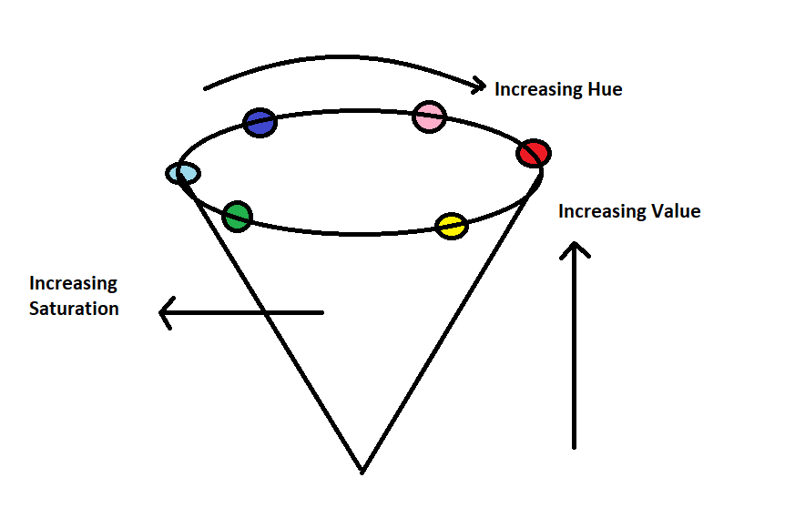

# **Working With Images** ✨

</br>

## **What Exactly Is an Image?** 🤔

An **image** is essentially a grid of tiny dots called pixels, which each hold color and brightness information. The dimensions of an image, such as 500 x 400 (width x height), tell us the total number of pixels: in this case, **200,000**! Each of these pixels is like a little tile, contributing to the bigger picture.

Here’s how pixels commonly represent color:

- **Grayscale** 🖤 - A single shade value between **0** (black) and **255** (white).
- **RGB** 🌈 - Three values for **Red**, **Green**, and **Blue** channels, each between 0 and 255.
- **RGBA** 🌫️ - Adds an **alpha** value to RGB for opacity, allowing for transparency effects.

Image processing software or tools apply sequences of operations to each pixel in an image. For example, one operation may adjust brightness, while another changes color saturation. Each operation applies uniformly to every pixel in the image, creating the final transformed image.


</br>

## **Let’s Dive In!** 🏃‍➡️

### 1. **Reading an Image**

```python
cv2.imread("path_to_image")
```

### 2. **Displaying an Image** 🖥️

```python
cv2.imshow("window_name", image)
```

### 3. **Writing/Saving an Image** 💾

```python
cv2.imwrite("name.format", image)
```

### 4. **Exploring Color Spaces** 🎨

Images use various color spaces to represent color. Here are some common ones:

- **RGB (Red, Green, Blue)** - The color model for most screens.

  

- **CMYK (Cyan, Magenta, Yellow, Black)** - Used in color printing.

  

- **HSV (Hue, Saturation, Value)** - Ideal for adjusting color intensity and lightness separately.

  

### 5. **Performing Arithmetic Operations on Images**

Image blending, brightness adjustment, and more are possible through arithmetic operations on pixels. Here’s how to add or subtract images:

```python
# Adding two images
cv2.add(img1, img2)

# Subtracting one image from another
cv2.subtract(img1, img2)
```

With these essentials in place, you’re ready to start exploring and experimenting with images!
