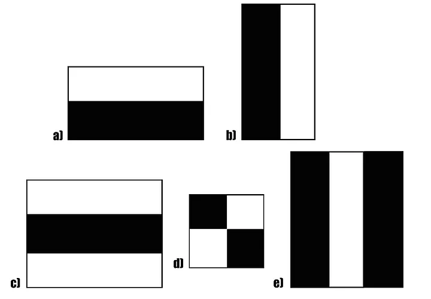
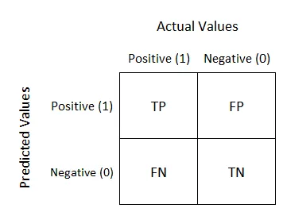
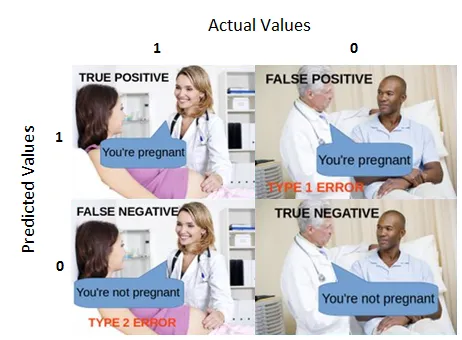

# Simple Image Processing ✨

## 😎 Face Detection

### Haar Cascade Classifier

Haar Cascade Classifier, atau dikenal juga sebagai _framework_ deteksi objek Viola-Jones (dikembangkan oleh Paul Viola & Michael Jones), pertama kali diperkenalkan pada tahun 2001 untuk menyelesaikan masalah deteksi wajah. Anda dapat membaca lebih lanjut artikel aslinya di [[**PAPER**](https://www.cs.cmu.edu/~efros/courses/LBMV07/Papers/viola-cvpr-01.pdf)].

Haar Cascade menggunakan konsep deteksi fitur dan teknik _sliding window_. Dalam teknik ini, sebuah _sliding window_ berjalan pada gambar untuk mendeteksi wajah dengan mencocokkan fitur wajah yang terdapat dalam setiap _window_ tersebut. Contohnya, Haar Cascade dapat mendeteksi area mata dan dahi pada wajah, sebagaimana diperlihatkan dalam ilustrasi berikut:

<div style="display: flex; flex-wrap: wrap; justify-content: center; gap: 10px;">
    
    
</div>
</br>

Adapun kelebihan dan kekurangan model Haar Cascade:

- **Kelebihan:**

  - Cepat dalam mendeteksi objek
  - Dapat diaplikasikan untuk deteksi **realtime**
  - Implementasi mudah dan tidak memakan banyak resource

- **Kekurangan:**

  - Tidak seakurat deteksi modern lainnya
  - Menghasilkan banyak **false positive**

</br>
<div style="display: flex; flex-wrap: wrap; justify-content: center; gap: 10px;">
    
    
</div>
</br>

## Face Detection dengan Haar Cascade Classifier

1. Siapkan Gambar

   Pertama-tama, muat gambar yang akan dianalisis lalu konversi ke grayscale suapaya deteksi lebih cepat dan akurat.

   ```python
   import cv2

   img = cv2.imread("path_to_image")
   gray = cv2.cvtColor(img, cv2.COLOR_BGR2GRAY)
   ```

2. Muat Model Cascade

   Selanjutnya, kita perlu memuat model **`Haar Cascade`** yang akan digunakan untuk mendeteksi wajah. Model berupa file XML dapat diunduh di [**GitHub OpenCV**](https://github.com/opencv/opencv/tree/master/data/haarcascades). File XML ini berisi fitur wajah yang diperlukan untuk proses deteksi.

   ```python
   face_cascade = cv2.CascadeClassifier("cascade_model.xml")
   ```

3. Deteksi Wajah dan Gambar Kotak Deteksi

   Setelah gambar dan model disiapkan, selanjutnya kita bisa melakukan deteksi wajah. Setiap wajah yang terdeteksi akan ditandai dengan kotak hijau.

   ```python
   # Deteksi wajah pada gambar
   faces = face_cascade.detectMultiScale(
       gray,              # Gambar grayscale
       scaleFactor=1.3,   # Faktor untuk mengecilkan ukuran gambar
       minNeighbors=5     # Jumlah tetangga minimum untuk mempertahankan deteksi
   )

   # Menandai setiap wajah yang terdeteksi dengan kotak deteksi
   for (x, y, w, h) in faces:
       # Menggambar kotak deteksi di sekitar wajah
       img = cv2.rectangle(
           img,            # Gambar asli
           (x, y),         # Koordinat kiri atas kotak
           (x + w, y + h), # Koordinat kanan bawah kotak
           (0, 255, 0),    # Warna kotak (hijau dalam format BGR)
           2               # Ketebalan garis kotak
       )
       # Memisahkan area wajah pada gambar grayscale dan berwarna
       roi_gray = gray[y:y+h, x:x+w]
       roi_color = img[y:y+h, x:x+w]
   ```

4. Tampilkan Hasil Deteksi

   Langkah terakhir adalah menampilkan gambar yang sudah ditandai.

   ```python
   cv2.imshow('Hasil Deteksi Wajah', img)
   cv2.waitKey(0)
   cv2.destroyAllWindows()
   ```

</br>

<div style="text-align: center; margin: 24px;">
  <a href="../README.md" style="
    display: inline-block;
    background-color: #e3383a;
    color: #fff;
    padding: 12px 24px;
    font-size: 16px;
    font-weight: bold;
    text-decoration: none;
    border-radius: 8px;
    transition: background-color 0.15s;
  " onmouseover="this.style.backgroundColor='#4caf50';" onmouseout="this.style.backgroundColor='#e3383a';">
    Kembali
  </a>
</div>
