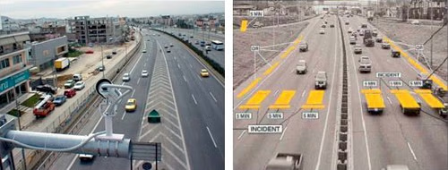
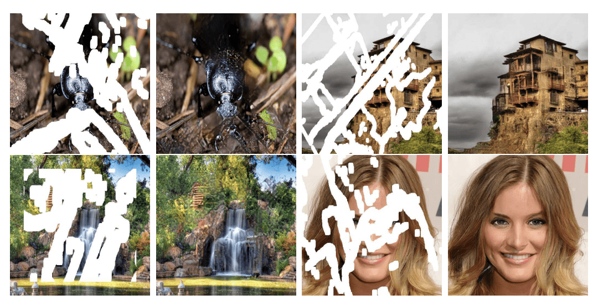
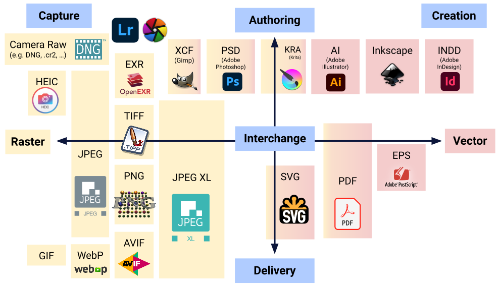
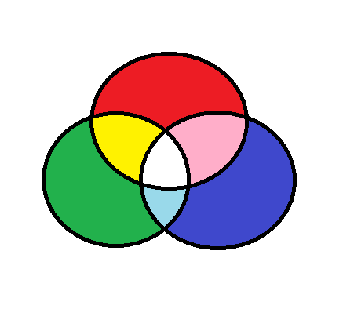
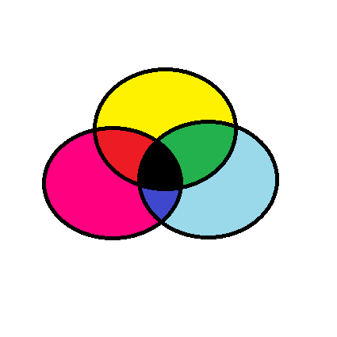
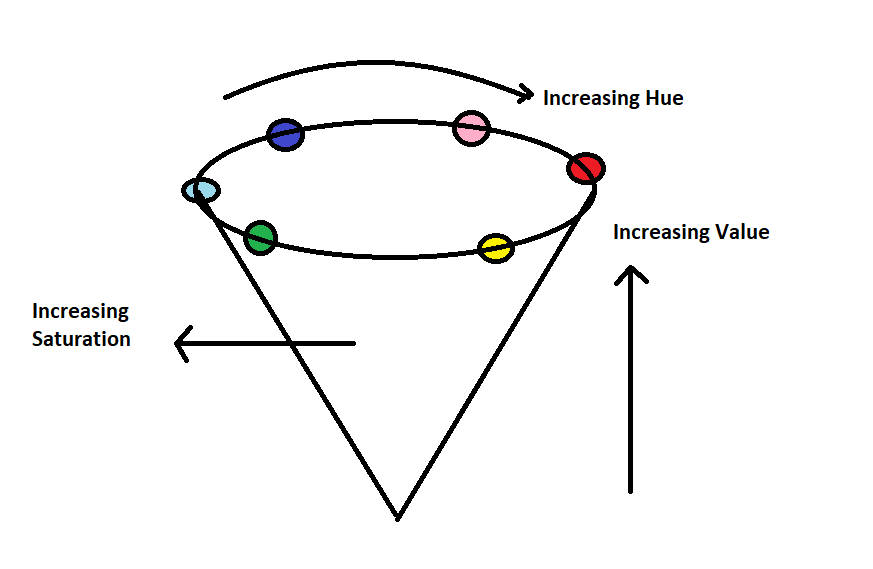

<h1 style="text-align: center;">
 🩷💙💛 IMAGE PROCESSING 🩷💙💛
</h1>

</br>

## **1. Introduction to Image Processing**

### **What Is Image Processing?**

Image processing is the process of transforming an image into a digital form and performing certain operations to get some useful information from it. The image processing system usually treats all images as 2D signals when applying certain predetermined signal processing methods.

There are five main types of image processing:

1. **Visualization** - Find objects that are not visible in the image
2. **Recognition** - Distinguish or detect objects in the image
3. **Sharpening and restoration** - Create an enhanced image from the original image
4. **Pattern recognition** - Measure the various patterns around the objects in the image
5. **Retrieval** - Browse and search images from a large database of digital images that are similar to the original image

### **Applications of Image Processing**

- **Traffic Sensing Technologies**

  

- **Image Reconstruction**
  

- **Face Detection**

  

sumber: https://www.simplilearn.com/image-processing-article#types_of_image_processing

</br>

## **2. Working with Images**

### **What Is an Image?**

Before we jump into image processing, we need to first understand what exactly constitutes an image. An image is represented by its dimensions (height and width) based on the number of pixels. For example, if the dimensions of an image are 500 x 400 (width x height), the total number of pixels in the image is 200000.

This pixel is a point on the image that takes on a specific shade, opacity or color. It is usually represented in one of the following:

- **Grayscale** - A pixel is an integer with a value between 0 to 255 (0 is completely black and 255 is completely white).

- **RGB** - A pixel is made up of 3 integers between 0 to 255 (the integers represent the intensity of red, green, and blue).

- **RGBA** - It is an extension of RGB with an added alpha field, which represents the opacity of the image.

Image processing requires fixed sequences of operations that are performed at each pixel of an image. The image processor performs the first sequence of operations on the image, pixel by pixel. Once this is fully done, it will begin to perform the second operation, and so on. The output value of these operations can be computed at any pixel of the image.



### **Lets get started**

1. Reading an image

   ```python
   cv2.imread("path_to_image")
   ```

2. Display an image

   ```python
   cv2.imshow("window_name", image)
   ```

3. Writing an image

   ```python
   cv2.imwrite("name.format", image)
   ```

4. Color Spaces

   RGB (Red, Green, Blue)

   

   CMYK (Cyan, Magenta, Yellow, Black)

   

   HSV (Hue, Saturation, Value)

   

5. Arithmethic Operation on Images

   ```python
   # adding images
   cv2.add(img1, img2)

   # subtract images
   cv2.subtract(img1, img2)
   ```

## Image Pre-processing

1. Image orientation

   ```python
   # Rotate 90 Degree Clockwise
   cv2.rotate(img, cv2.ROTATE_90_CLOCKWISE)

   # Rotate 90 Degree Counter Clockwise
   cv2.rotate(img, cv2.ROTATE_90_COUNTERCLOCKWISE)

   # Rotate 180 Degree Clockwise
   cv2.rotate(img, cv2.ROTATE_180)
   ```

2. Image flip

   ```python
   # Flip horizontally
   cv2.flip(img, 1)

   # Flip verticallly
   cv2.flip(img, 0)

   # Flip horizontally and verticallly
   cv2.flip(img, -1)
   ```

3. Color space
